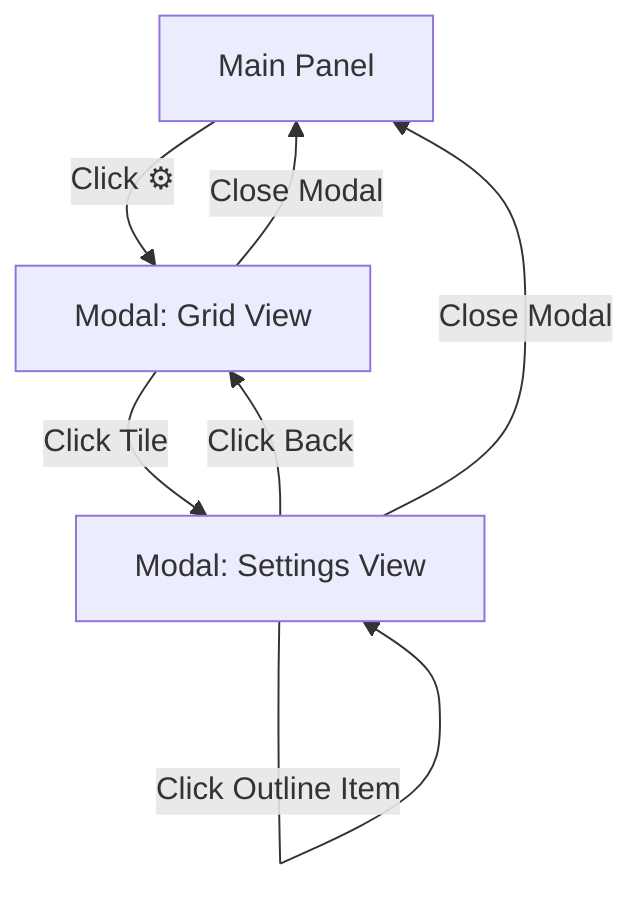

# 🎭 UI Architecture: Two-Level Grid Navigation

## 📐 **SYSTEM OVERVIEW**

```
┌─────────────────────────────────────────────────────────────────┐
│                       USER INTERFACE FLOW                        │
└─────────────────────────────────────────────────────────────────┘

LEVEL 1: Main Panel (Always Visible)
┌──────────────────┐
│  🎛️ Effects     │
│  ─────────────   │
│  ☑ 🐍 ClickSnake │  ← Quick toggles
│  ☐ ✨ Random     │
│  ☐ 🔄 Orbit      │
│                  │
│  [⚙️] Settings   │  ← Click cog → Opens modal
│  [🗑️ Clear All]  │
└──────────────────┘

                ↓ Click ⚙️

LEVEL 2: Settings Modal (Grid View)
┌────────────────────────────────────────────────┬─────────────┐
│              ⚙️ Settings                       │  OUTLINE    │
│       Choose a category to configure           │  ═════════  │
│                                                 │             │
│  ┌────────────┬────────────┐                  │ 🖱️ Drag     │
│  │   ⚡ CLICK │  🖱️ DRAG  │                  │  🐍 Snake   │
│  │  Effects   │  Effects   │                  │             │
│  │ Coming Soon│  1 effect  │ ← Click tile     │ ✨ Idle     │
│  └────────────┴────────────┘                  │  ✨ Cubes   │
│  ┌────────────┬────────────┐                  │  🔄 Orbit   │
│  │  ✨ IDLE  │  🌍 GLOBAL │                  │             │
│  │  Effects   │  Settings  │                  │ 🌍 Global   │
│  │ 2 effects  │            │                  │  🎨 BG      │
│  └────────────┴────────────┘                  │  ⏱️ Timing  │
│                                                 │             │
└────────────────────────────────────────────────┴─────────────┘

                ↓ Click "🖱️ Drag Effects"

LEVEL 2: Settings Modal (Settings View)
┌────────────────────────────────────────────────┬─────────────┐
│  [← Back]  🖱️ Drag Effects Settings           │  OUTLINE    │
│  ════════════════════════════════════          │  ═════════  │
│                                                 │             │
│  🐍 Click Snake                                │ 🖱️ Drag  ★  │
│  ═════════════                                 │  🐍 Snake   │
│                                                 │             │
│  Max Length:        [═══●════] 200             │ ✨ Idle     │
│  Cube Size:         [══●═════] 1.0             │  ✨ Cubes   │
│  Fade Speed:        [●═══════] 0.01            │  🔄 Orbit   │
│  ☑ Enable Rotation                             │             │
│  Rotation Speed:    [═●══════] 0.1             │ 🌍 Global   │
│  Z-Position Mode:   [Wave ▼]                   │  🎨 BG      │
│  Z Min:             [══●═════] -5              │  ⏱️ Timing  │
│  Z Max:             [═══════●] 10              │             │
│  Z Variance:        [═══●════] 2               │             │
│  ☑ Auto Fade                                   │             │
│  ☑ Random Colors                               │             │
│  Fixed Color:       [#ff00ff]                  │             │
│                                                 │             │
└────────────────────────────────────────────────┴─────────────┘
```

---

## 🏗️ **COMPONENT STRUCTURE**

### **1. Main Panel** (`index.html` - Simple Panel)
- **Purpose**: Quick effect toggles
- **Features**:
  - Checkbox for each effect (on/off)
  - Cog button (⚙️) to open settings
  - Clear All button
- **Styling**: `public/styles/panel-simple.css`

### **2. Settings Modal** (`index.html` - Modal Container)
- **Purpose**: Deep configuration interface
- **Two Views**:
  - **Grid View**: 2x2 category selector
  - **Settings View**: Detailed controls for chosen category

### **3. Grid Menu** (`public/styles/grid-menu.css`)
- **Layout**: 2x2 grid
- **Tiles**:
  - ⚡ **Click Effects** (future)
  - 🖱️ **Drag Effects** (ClickSnake)
  - ✨ **Idle Effects** (RandomCubes, CameraOrbit)
  - 🌍 **Global** (Backgrounds, Timing)
- **Features**:
  - Hover animations
  - Color-coded borders
  - Effect count badges

### **4. Outline Panel** (`public/styles/outline-panel.css`)
- **Purpose**: Quick navigation (IDE-style)
- **Features**:
  - Organized by category
  - Active effect badges
  - Click to jump to settings
  - Persistent across views

---

## 🔄 **NAVIGATION FLOW**



### **User Actions:**
1. **Main Panel**:
   - Toggle effects on/off quickly
   - Click ⚙️ → Open settings modal

2. **Grid View**:
   - See all 4 categories at once
   - Click any tile → Load settings
   - Use outline panel → Jump directly

3. **Settings View**:
   - Configure detailed parameters
   - Click Back → Return to grid
   - Close modal → Return to main panel

---

## 📂 **FILE ORGANIZATION**

```
threeJS/
├── index.html                          ← Main HTML (simplified)
├── ui/
│   ├── modal-manager.js                ← Grid navigation logic
│   ├── ui-controller.js                ← Main orchestrator
│   ├── ui-init.js                      ← Initialize controls
│   └── event-handlers.js               ← Wire up events
└── public/styles/
    ├── panel-simple.css                ← Main panel styling
    ├── grid-menu.css                   ← 2x2 grid tiles
    ├── outline-panel.css               ← IDE-style navigator
    └── modal.css                       ← Modal container
```

---

## 🎨 **DESIGN PRINCIPLES**

### **Separation of Concerns:**
- **Main Panel**: Quick actions (toggles, clear)
- **Grid View**: Category selection
- **Settings View**: Deep configuration

### **Progressive Disclosure:**
- Show simple controls first
- Hide complexity behind cog button
- Group related settings by category

### **Visual Hierarchy:**
- Main panel = minimal (3 toggles + 1 button)
- Grid = medium (4 big tiles)
- Settings = detailed (all sliders/inputs)

---

## 🚀 **FUTURE EXPANSION**

### **Easy to Add:**
1. **New Effect Category**: Add a tile to grid
2. **New Effect**: Add to appropriate template
3. **New Global Setting**: Add to global template

### **Template System:**
- Each category has a `<template>` in HTML
- Modal manager loads template on tile click
- Dynamic re-initialization via custom events

---

## 🔧 **TECHNICAL DETAILS**

### **Modal Manager** (`ui/modal-manager.js`)
```javascript
openModal()           // Show modal with grid
openCategory(name)    // Load category template
showGridView()        // Return to grid
showSettingsView()    // Show settings panel
```

### **Custom Events**
- `category-loaded`: Fired when template loads
- Triggers re-initialization of controls

### **Dynamic Content**
- Templates stored in HTML
- Loaded via `innerHTML`
- Controls wired up after load

---

## 📊 **METRICS**

- **Main Panel**: 4 elements (minimal!)
- **Grid View**: 4 tiles (clear choices)
- **Settings**: 10-15 controls per category (detailed)
- **Outline**: Always visible (navigation aid)

---

This architecture balances **simplicity** (main panel) with **power** (settings modal), creating an intuitive yet flexible UI system. 🎉

